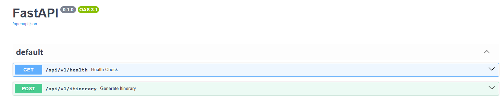
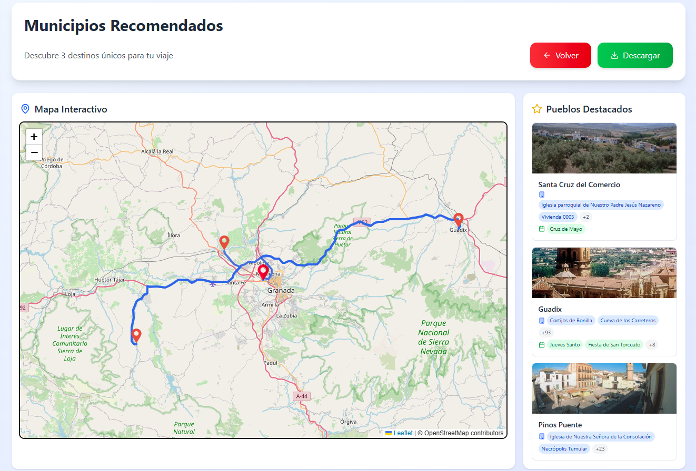

# Smart-Itinerary-Generator

[](https://www.python.org/)
[](https://github.com/astral-sh/uv)
[](https://github.com/astral-sh/ruff)
[](LICENSE)


## Table of Contents

- [📦 Project Overview](#project-overview)
- [🗂️ Project Structure](#️project-structure)
- [🚀 Main Technologies Used](#main-technologies-used)
- [🐳 Run with Docker](#run-with-docker)
- [🧠 Why Use Embeddings?](#why-use-embeddings)
- [📦 Modules Summaries](#Module-Summaries)
  - [semantic-embeddings](#semantic-embeddings)
  - [scraper](#scraper)
  - [backend](#backend)
  - [frontend](#frontend)
- [📄 License](#license)


## 📦 Project Overview <a id="project-overview"></a>

This large project is divided into three backend services plus frontend. First, data from municipalities in Andalusia is scraped and used to generate a database with embeddings. Embeddings and semantic text/rerank are served through a dedicated `semantic-embeddings` microservice. Then the itinerary `API` filters based on user preferences and searches using cosine similarity to find the municipalities that best match what the user is looking for. Finally, a frontend displays both a form to submit data to the `API` and an interactive map with the results.

## 🗂️ Project Structure <a id="project-structure"></a>

- [📁 backend](./backend/README.md)
- [📁 frontend](./frontend/README.md)
- [📁 scraper](./scraper/README.md)
- [📁 semantic-embeddings](./semantic-embeddings/README.md)
- [📁 screenshots](./screenshots/)
  - 📄 [minio.png](./screenshots/minio.png)
  - 📄 [postgres.png](./screenshots/postgres.png)
  - 📄 [prefect-server.png](./screenshots/prefect-server.png)
- 📄 [.dockerignore](.dockerignore)
- 📄 [.gitignore](.gitignore)
- 📄 [docker-compose.yml](./docker-compose.yml)
- 📄 [LICENSE](./LICENSE)
- 📄 [main.html](./main.html)
- 📄 [README.md](./README.md)


## 🚀 Main Technologies Used <a id="main-technologies-used"></a>

- **Python 3.12**: Main programming language.
- **Prefect**: Orchestrates and schedules scraping and data-processing tasks.
- **PostgreSQL**: Stores structured data and embeddings.
- **MinIO**: Object storage compatible with Amazon S3, used for storing tasks reports.
- **Selenium**: Automates interactions with dynamic websites.
- **BeautifulSoup**: Parses and extracts data from static HTML.
- **SQLAlchemy**: ORM for interacting with PostgreSQL.
- **Semantic-Embeddings API**: External embedding/reranking inference service used by scraper and backend.
FastAPI: Lightweight, high-performance web framework for building backend APIs.
- **React**: JavaScript library for building interactive user interfaces on the frontend.
- **Leaflet**: Open-source JavaScript library for interactive maps, used to display and select town locations.
- **Valhalla**: OpenStreetMap-based routing engine used to calculate isochrones (e.g., filter towns reachable within 60 minutes).


## 🐳 Run with Docker <a id="run-with-docker"></a>


```bash
git clone https://github.com/cberdejo/Smart-Itinerary-Generator.git
cd Smart-Itinerary-Generator
docker-compose up --build
```


## 🧠 Why Use Embeddings? <a id="why-use-embeddings"> </a>

Embeddings convert apartment descriptions into **numerical vectors** that capture semantic meaning. This enables **search by similarity** (e.g., "Find apartments like this one") using metrics like **cosine similarity**.

You can perform semantic search in two main ways:

- Directly in the database using vector extensions like `pgvector` or `PGEmbedding`.

- Externally using vector databases such as `FAISS`, `Qdrant`, or `Pinecone`.

In this project, we work only with towns in Andalusia, which means the total dataset is under 1,000 items. Given this small and fixed size:

- Keeping all vectors in memory is fast and lightweight.

- `scikit-learn`'s cosine_similarity is efficient for this scale.

- There's no need to install or maintain external vector services or database extensions.

It keeps the stack simple and fully in Python.

This makes `scikit-learn` a clean and practical choice for computing similarity between embeddings.

## 📦 Module Summaries

### [`semantic-embeddings`](/semantic-embeddings/)
Dedicated microservice for semantic operations shared by `backend` and `scraper`.

- Generates dense vectors via `/embed`
- Scores relevance via `/rerank`
- Builds canonical retrieval text via `/search-text/town*` and `/search-text/municipality*`

---

###  [`scraper`](/scraper/)
This module automates the collection of tourism and cultural data from Andalusian towns. It leverages **Selenium**, **BeautifulSoup**, **Prefect**, and the **semantic-embeddings API** to:

- Fetch town data from official sources (Junta de Andalucía, Wikipedia, IAPH, and andalucia.org)
- Generate semantic **embeddings**
- Store the structured results in **PostgreSQL**
- Upload execution reports to **MinIO**

📌 *Example:*


---

###  [`backend`](/backend/)
A **FastAPI**-based microservice that:

- Generates personalized travel itineraries based on user input and **semantic similarity**
- Uses **Valhalla** to compute real driving times between towns
- Exposes endpoints like `/api/v1/itinerary` and `/api/v1/health`
- Scores towns using **cosine similarity** between user preferences and embeddings

📌 *Example of API interface:*


---

### [`frontend`](/frontend/)
A modern **React + Tailwind + Leaflet** frontend that:

- Offers a dynamic form for setting preferences and picking a location
- Displays results as interactive routes and cards on a live map
- Allows users to download a **PDF report** of the suggested itinerary

📌 *UI Example:*
  


---


## 📄 License <a id="license"> </a>

MIT – free to use, modify and distribute.
