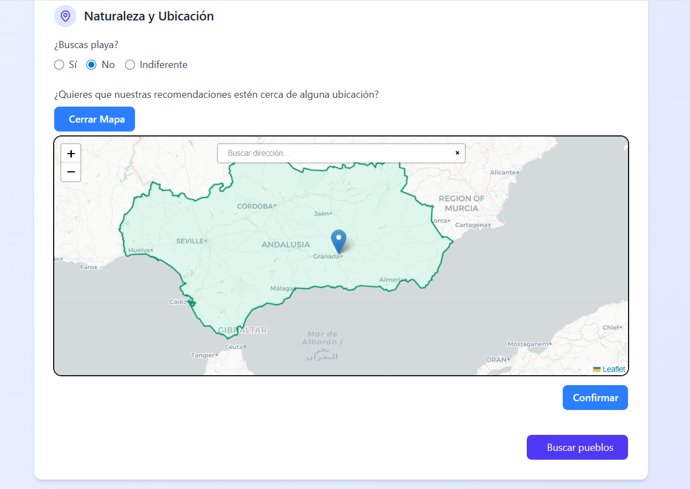
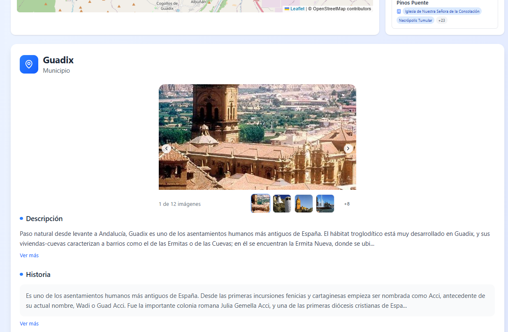
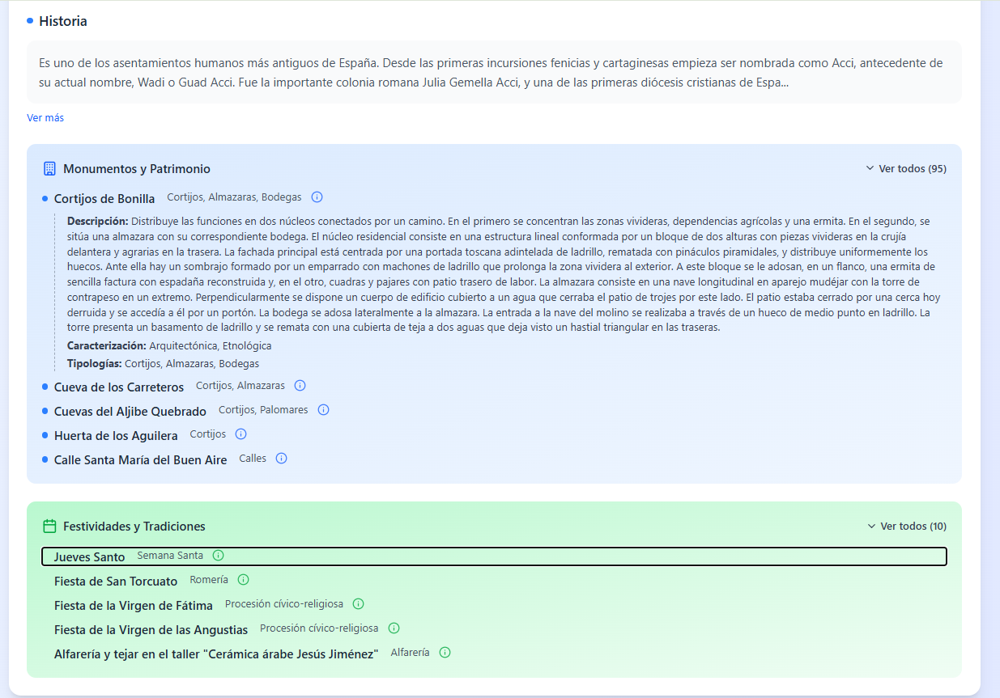

#  Frontend

A modern and interactive React frontend that visualizes and enhances the experience of generating smart travel itineraries across Andalusia. It’s tightly integrated with the backend API and designed with attention to detail, accessibility, and usability.


## ⚙️ Tech Stack

- **React** — Functional components & hooks
- **Tailwind CSS** — Utility-first CSS framework for custom design
- **Leaflet.js** — Interactive maps with markers, routes, and custom layers
- **html2canvas + jsPDF** — PDF generation from map and DOM
- **Vite** — Fast development server and build tool 

---

## ✨ Features

- 📋 **Dynamic Form** — Users can input their preferences and select a custom location
- 🗺️ **Interactive Map** — Click or search to select a location, restricted to Andalusia
- 📍 **Route Visualization** — View optimized itineraries over a live map
- 🖼️ **Cultural Insights** — Visual display of monuments and traditions
- 🧾 **PDF Report** — Generate detailed printable reports
- 🧠 **State Persistence** — Remembers your last session via `localStorage`
- 🌙 **Dark-aware design** — Soft gradients and clarity for long usage

---

## 🧱 Project Structure


---

## 🚀 Installation
You can create a `.env` file for frontend API settings  `VITE_API_URL=http://localhost:8000/api/v1`

### 📦 Using Vite

```bash
npm install
npm run dev
```

The app will be available at `http://localhost:5173`.

### 🐳 Docker Setup

If you prefer Docker:

```bash
docker build -t smart-itinerary-frontend .
docker run -p 5173:5173 smart-itinerary-frontend
```


## 🔁 State Flow

- Submits preferences via POST to `/api/v1/itinerary`
- Displays towns and trip route on Leaflet map
- Allows exploring towns visually, with rich descriptions
- Generates PDF reports (map + town summaries)


## Interfaces overview
### Form

There is a form to write the preferences (the answers will be used by an `API` to search by similarity using embeddings)


You can pick a location tu make sure results are nearby



### Itinerary Generated

You can download a report with all the itinerary info and, click in any marker or card in the right column to view more details of the municipality selected.


Some of the info included for each municipality are images, description, history, monuments and popular events 




## 📜 License

MIT © 2025 — Developed for academic and educational purposes.
